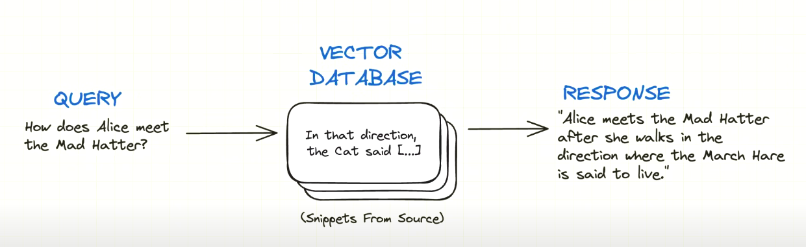
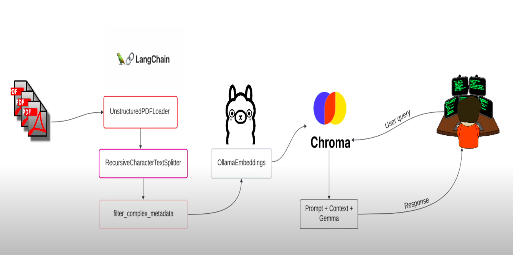
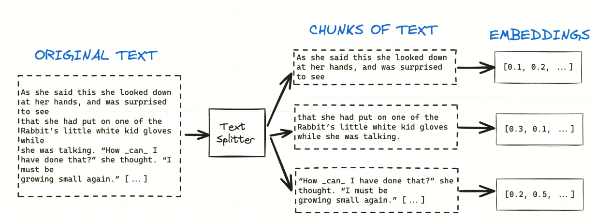

# Consult yours pdfs locally with RAG and Ollama

## Whats a RAG:

Lets get started with a history. In a courtroom, judges hear and decide cases based on their general undestanding of the law. Sometimes a case requires special expertise, so judges send an assistent to the law library for looking for precedents and specific cases they can cite and to base.

Like a judge(good judges), large language models(LLMs) can respond to a wide variety of human questions. But to give authorite answers that cite sources, the model needs an assistent to do some research. The judge assistent going to look for some materials is a process called retrivial-augmented generation(RAG).

RAG is technique for enhancing the accuracy and realiability of generative AI models with facts searched from external sources. So we send questions for RAG and it search in a database, took some materials and put them in prompt with your quesiton and send to LLM. In this whay, we combine internal with external resources.

And for test the RAG, we use the AI ​​itself to judge whether the question is correct or not.




For store our pdfs informations, we use a vector database. A vector database, is a database that can store vectors (fixed-length lists of numbers) along with other data items. Vector databases typically implement one or more Approximate Nearest Neighbor (ANN) algorithms, so that one can search the database with a query vector to retrieve the closest matching database records.

To populate the database, we first split our text in some chunks and transform them in embeddings(vector numbers) with a IA model to this.


## How to run:
- We will use IA models locally. Of course, if you want to use a model to make the embeddings or for the LLM in a server, you can adapt this code for this.

### install ollama for linux:
```bash
$ curl -fsSL https://ollama.com/install.sh | sh
```
- For verify(in linux) if the server is running, type:

```bash 
$ sudo systemctl status ollama
```

- If you want to install for other SO's, click [here](https://ollama.com/download).

### Install ollama models:

### nomic-embed-text:
- This model is a "A high-performing open embedding model with a large token context window".
    ```bash
    $ ollama pull nomic-embed-text
    ```

### mistral:
- A cutting-edge generative model that has been specifically designed and optimized for code generation tasks, including fill-in-the-middle and code completion
    ```bash
    $ ollama pull mistral
    ```

- Verify installed models with:
    ```bash
    $ ollama list
    ```

- For other models: [ollama models library](https://ollama.com/library)

### Requiriments:
- After install ollama, models and clone the project in your machine, you need install the requirements:
    
    - First create the enviroment and activate it:
    ```bash
    $ python -m venv .venv
    $ source .venv/bin/activate
    ```
    - Install:

    ```bash
    $ pip install -r requirements.txt
    ```

### Populate the database:
- you can put into data directory the pdfs you want to storage, and store them in chroma db with the command:

    ```bash
    $ python src/populate_database.py
    ```

### Doing your questions for the LLM:
- Now, you can do your questions about yours pdfs:
    ```bash
    $ python src/query_data.py "Do the questions here!"
    ```

### Running the tests:
    ```bash
    $ pytest -s
    ```

- For more informations see:
  
  - [NVIDIA blog about RAG](https://blogs.nvidia.com/blog/what-is-retrieval-augmented-generation/) 
  - [Wikipedia about vector database](https://en.wikipedia.org/wiki/Vector_database)

- If this material helps you, star and share the repository.